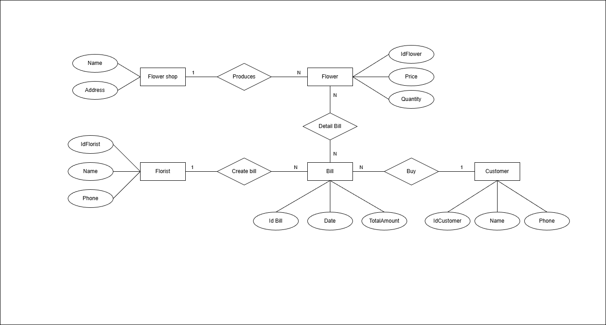

# E-R của hệ thống Quản lý Cửa Hàng Bán Hoa Offline

- Các thực thể (Entity): `Flower shop`, `Flower`, `Florist`, `Bill`, `Customer`.

- Mối quan hệ:
    
    - `Flower shop` 1-N `Flower`.

        - Một `CỬA HÀNG HOA` có nhiều loài `HOA`.
        - Một loài `HOA`. trong một `CỬA HÀNG HOA`.

    - `Flower` 1-N `Bill`.

        - Một `NHÂN VIÊN` có thể lập nhiều `HÓA ĐƠN` khác nhau (trong ca làm việc).
        - Một `HÓA ĐƠN` cụ thể chỉ do một `NHÂN VIÊN` lập.

    - `Customer` 1-N `Bill`

        - Một `HÓA ĐƠN` có thể bao gồm nhiều loại `HOA` (khách mua 1 bó hồng và 2 cành ly).
        - Một loại `HOA` (Hồng đỏ) có thể nằm trên nhiều `HÓA ĐƠN` khác nhau.

    -  `Bill` N-M `Flower`.

        - Một `HÓA ĐƠN` có thể bao gồm nhiều loại `HOA` (khách mua 1 bó hồng và 2 cành ly).

        - Một loại `HOA` (Hồng đỏ) có thể nằm trên nhiều `HÓA ĐƠN` khác nhau.